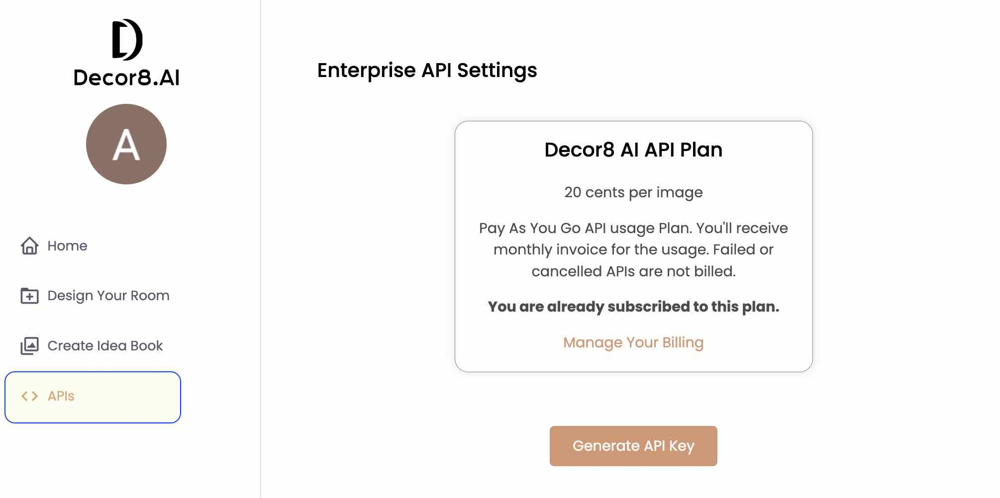
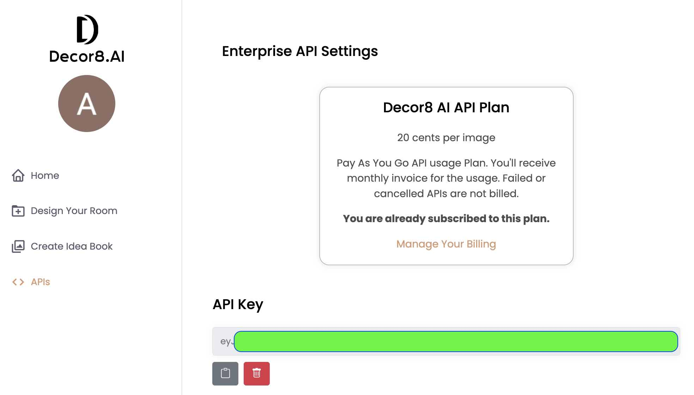

# Decor8 AI Python SDK

## Overview

The Decor8 AI Python SDK is a powerful tool to integrate and utilize Decor8 AI’s design generation capabilities seamlessly within your Python environment. With this SDK, you can easily generate designs by providing room images in various formats, specifying room types, design styles, and various other parameters.

## Installation

You can install the Decor8 AI Python SDK using pip:

```bash
pip install decor8ai
```

## Configure Decor8 AI API key

### Sign in to [Decor8 AI](https://prod-app.decor8.ai)

### Click on Profile Photo on Top Left



### Click Generate API Key



## Usage

### Python
```bash
export DECOR8AI_API_KEY='<YOUR_API_KEY>'
```

```python
from decor8ai import generate_designs

# Generate designs
response = generate_designs(
    input_image='/path/to/your/image.jpg',  # Can be a file path, URL, or binary data
    room_type='livingroom',
    design_style='scandinavian',
    num_images=4
)

# The response is a JSON object containing the generated designs and other information.
```

### HTTP
```bash
# Variables
ROOM_TYPE="your_room_type"
DESIGN_STYLE="your_design_style"
NUM_IMAGES="1"
NUM_CAPTIONS="your_num_captions_value"  # Optional
INPUT_IMAGE_PATH="path/to/your/input/image.jpg"
TOKEN="your_decor8ai_api_key"
URL="https://prod-app.decor8.ai:8000/generate_designs"

# Base curl command
curl -X POST $URL \
     -H "Authorization: Bearer $TOKEN" \
     -F "room_type=$ROOM_TYPE" \
     -F "design_style=$DESIGN_STYLE" \
     -F "num_images=$NUM_IMAGES" \
     -F "input_image=@$INPUT_IMAGE_PATH"

# If you have num_captions
# -F "num_captions=$NUM_CAPTIONS" \

# If you have room_options_json
# -F "room_options_json=$ROOM_OPTIONS_JSON" \

```

